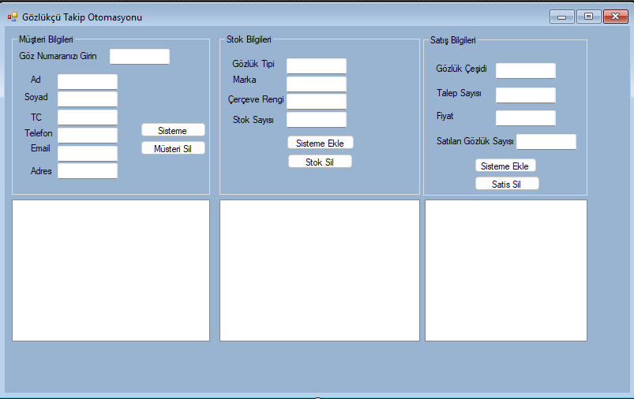

# 📖 Gözlükçü Takip Otomasyonu

<p align="center">
  
</p>

## 📋 Proje Açıklaması
C# Windows Forms ile geliştirilen bu otomasyon sistemi, gözlükçü işletmeleri için müşteri bilgileri, stok takibi ve satış yönetimi sağlar.

## 🛠 Teknolojiler
- **Programlama Dili:** C#
- **Veritabanı:** SQLite (DB Browser)
- **ORM:** Entity Framework 6
- **IDE:** Visual Studio 2015 veya üzeri
- **Platform:** Windows

## ✨ Temel Özellikler
| Modül        | Özellikler |
|--------------|------------|
| **Müşteri Yönetimi** | - Müşteri kayıt işlemleri<br>- Göz numarası takibi<br>- Detaylı müşteri bilgileri |
| **Stok Yönetimi** | - Gözlük çeşitleri yönetimi<br>- Renk ve marka bazlı filtreleme<br>- Stok takip sistemi |
| **Satış Yönetimi** | - Satış kayıt işlemleri<br>- Temel raporlama özellikleri |

## 🚀 Kurulum ve Çalıştırma

### Gereksinimler
- .NET Framework 4.5.2 veya üzeri
- SQLite için sistem kurulumu

### Adımlar
1. Projeyi klonlayın:
```bash
git clone https://github.com/iegeytek/GozlukTakipOtomasyonu.git
cd GozlukTakipOtomasyonu